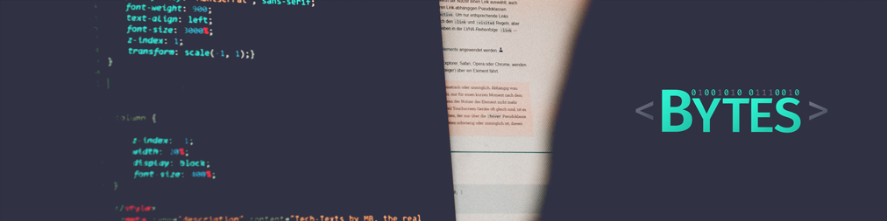

# Jr Bytes

🌱 Atualmente estou lendo o livro de refatoração do Martin Fowler. O repositório do conteúdo é [refactoring](https://github.com/jrbytes/refactoring). O código está com babel, editorconfig, eslint e prettier configurado.

👨‍🎓 Me enlouqueceram: fiz a faculdade e aprendi muita teoria, que hoje são responsáveis pela absorção do conteúdo que consumo. Porém, no bootcamp que fiz após a facul, eles pregam uma filosofia de aprender com a prática. No meu ver as duas premissas são válidas, porém a primeira te prepara e a segunda você tem mais surpresas.

👨🏻‍💻 A ficção científica para mim é a capacidade de sonhar e realizar. Muitas tecnologias antes de surgirem, foram protagonistas na literatura e nos meios audiovisuais.

🖖🏼 Vida longa e próspera ou | or Live long and prosper. É uma frase dita pelo Vulcano Spock em Star Trek. Você verá isso muito por aí, enquanto visita meu GitHub. 😉

📫 Pode entrar em contato comigo pelo e-mail ou insta @jrbytes será um prazer.

🎓 Análise e Desenvolvimento de Sistemas - FAEL  
👨🏻‍🚀 Rocketseat Bootcamp GoStack 11  
🌎 [bytes.dev](https://bytes.dev)  